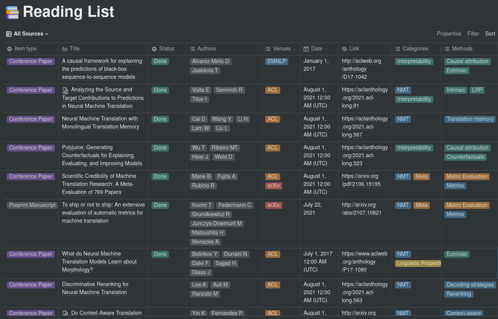

# Paperpile Notion Integration

This repository provides a simple integration between [Paperpile](https://paperpile.com/) and [Notion](www.notion.so) using the new [Notion API](https://developers.notion.com/). The purpose is to make it easy to periodically sync a list of papers in Paperpile to a Notion database.

This is a work in progress, and is currently intended for personal use only (no support, no warranty, no liability, etc.).

## Installation

Simply clone the repo locally and install the dependencies, preferably in a virtualenv:

```shell
git clone https://github.com/gsarti/paperpile-notion.git
cd paperpile-notion
pip install pyyaml notion-database rich
```

## Requirements

To run the script, you will need the following things:

1. A CSV file exported from Paperpile containing the list of papers and their metadata. [data.csv](data.csv) is an example of an exported CSV. For now, this needs to be manually downloaded and moved to this folder since Paperpile does not provide any API for exporting data.

2. A configuration file to map categories, journals and conferences to their acronyms. [config.yaml](config.yaml) is an example of a configuration file containing major AI and NLP conferences and journals.

3. A database id for the Notion database you want to sync to. To retrieve the database id, follow the directions provided [here](https://developers.notion.com/docs/working-with-databases). The current structure for the database must contain at least the following columns:

    - `Item type`  ( `select` ): Corresponds to the `Item type` field in the Paperpile export (e.g. `Conference Paper`, `Journal Article`, etc.).

    - `Title`  ( `title` ): The title of the paper.

    - `Status` ( `select` ): Set to `Done` when the paper was read, empty otherwise. Can take other values.

    - `Authors` ( `multi_select` ): The paper's authors. Corresponds to the `Authors` field in the Paperpile export, with only lastnames and first letter of firstnames.

    - `Venues` ( `multi_select` ): The venues in which the paper was published. Based on the config sections for mapping names to acronyms. Multiselect to specify e.g. conference + arXiv.

    - `Date` ( `date` ): The date the paper was published.

    - `Link` ( `url` ): Link to the paper. If multiple links are available, arXiv links are preferred.

    - `Categories` ( `multi_select` ): The categories the paper belongs to. Define the macro-fields to which the paper belongs.

    - `Methods` ( `multi_select` ): The methods and aspects investigated in the paper. Can be whatever, from architectures (e.g. CNN, Transformer) to sub-topics (e.g. Probing tasks for interpretability research).

4. A Notion API key. To retrieve the API key, follow the directions provided in the [Notion API Getting Started](https://developers.notion.com/docs/getting-started). You will also need to add permission for the integration on the database from the previous point.

## Usage

Once everything is in place, simply run the script as:

```shell
python update_db.py \
    --input data.csv \
    --config config.yaml \
    --database <YOUR_DB_ID> \
    --token <YOUR_NOTION_API_KEY>
```

Example output, adding a new paper to the database:


Example resulting database on Notion:

